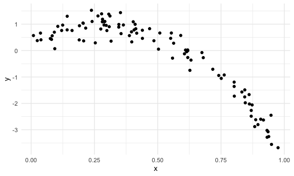
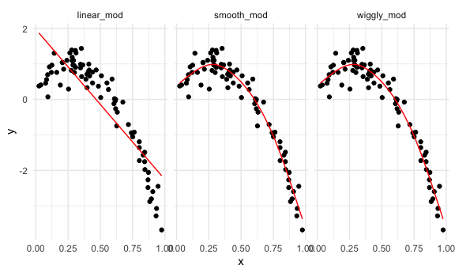

Cross-Validation
================

## Simulate data

``` r
nonlin_df = 
  tibble(
    id = 1:100,
    x = runif(100, 0, 1),
    y = 1 - 10 * (x - .3) ^ 2 + rnorm(100, 0, .3)
  )
```

Look at the data

``` r
nonlin_df %>% 
  ggplot(aes(x = x, y = y)) +
  geom_point()
```



## Cross validation – by hand

Get training and testing datasets

``` r
train_df = sample_n(nonlin_df, size = 80)
test_df = anti_join(nonlin_df, train_df, by = "id")
```

Fit 3 models.

``` r
linear_mod = lm(y ~ x, data = train_df)
smooth_mod = gam(y ~ s(x), data = train_df)
wiggly_mod = gam(y ~ s(x), sp = 10e-6, data = train_df)
```

can I see what I just did…

``` r
train_df %>% 
  gather_predictions(linear_mod, smooth_mod, wiggly_mod) %>% 
  ggplot(aes(x = x, y = y)) +
  geom_point() +
  geom_line(aes(y = pred), color = "red") +
  facet_grid(. ~ model)
```


Look at prediction accuracy

``` r
rmse(linear_mod, test_df)
```

    ## [1] 0.8641585

``` r
rmse(wiggly_mod, test_df)
```

    ## [1] 0.3371298

``` r
rmse(smooth_mod, test_df)
```

    ## [1] 0.3371298

## Cross validation using `modelr`

``` r
cv_df = 
  crossv_mc(nonlin_df, 100)
```

What is happening here…

``` r
cv_df %>% pull(train) %>% .[[1]] %>% as_tibble()
```

    ## # A tibble: 79 x 3
    ##       id     x      y
    ##    <int> <dbl>  <dbl>
    ##  1     1 0.619 -0.263
    ##  2     2 0.316  0.357
    ##  3     3 0.763 -0.924
    ##  4     4 0.918 -2.63 
    ##  5     5 0.554  0.666
    ##  6     7 0.631 -0.360
    ##  7     8 0.606 -0.122
    ##  8     9 0.417  0.659
    ##  9    10 0.802 -1.36 
    ## 10    12 0.282  1.19 
    ## # … with 69 more rows

``` r
cv_df %>% pull(test) %>% .[[1]] %>% as_tibble()
```

    ## # A tibble: 21 x 3
    ##       id      x       y
    ##    <int>  <dbl>   <dbl>
    ##  1     6 0.0805  0.424 
    ##  2    11 0.485   0.373 
    ##  3    17 0.162   0.762 
    ##  4    28 0.105   0.917 
    ##  5    30 0.751  -1.05  
    ##  6    32 0.396   0.710 
    ##  7    37 0.190   0.404 
    ##  8    39 0.614  -0.0420
    ##  9    59 0.364   0.971 
    ## 10    61 0.142   0.785 
    ## # … with 11 more rows

``` r
cv_df =
  cv_df %>% 
  mutate(
    train = map(train, as_tibble),
    test = map(test, as_tibble)
  ) %>% view()
```

Let’s try to fit models and get RMSEs for them.

``` r
cv_df %>% 
  mutate(
    linear_mod = map(.x = train, ~lm(y ~ x, data = .x))
  )
```

    ## # A tibble: 100 x 4
    ##    train             test              .id   linear_mod
    ##    <list>            <list>            <chr> <list>    
    ##  1 <tibble [79 × 3]> <tibble [21 × 3]> 001   <lm>      
    ##  2 <tibble [79 × 3]> <tibble [21 × 3]> 002   <lm>      
    ##  3 <tibble [79 × 3]> <tibble [21 × 3]> 003   <lm>      
    ##  4 <tibble [79 × 3]> <tibble [21 × 3]> 004   <lm>      
    ##  5 <tibble [79 × 3]> <tibble [21 × 3]> 005   <lm>      
    ##  6 <tibble [79 × 3]> <tibble [21 × 3]> 006   <lm>      
    ##  7 <tibble [79 × 3]> <tibble [21 × 3]> 007   <lm>      
    ##  8 <tibble [79 × 3]> <tibble [21 × 3]> 008   <lm>      
    ##  9 <tibble [79 × 3]> <tibble [21 × 3]> 009   <lm>      
    ## 10 <tibble [79 × 3]> <tibble [21 × 3]> 010   <lm>      
    ## # … with 90 more rows

Let’s try to fit models and get RMSEs for them

``` r
cv_df_new = 
cv_df %>% 
  mutate(
    linear_mod = map(.x = train, ~lm(y ~ x, data = .x)),
    smooth_mod = map(.x = train, ~gam(y ~ s(x), data = .x)),
    wiggly_mod = map(.x = train, ~gam(y ~s(x), sp = 10e-6, data = .x))
  ) %>% 
  mutate(
    rmse_linear = map2_dbl(.x = linear_mod, .y = test, ~rmse(model = .x, data = .y)),
    rmse_smooth = map2_dbl(.x = linear_mod, .y = test, ~rmse(model = .x, data = .y)),
    rmse_wiggly = map2_dbl(.x = linear_mod, .y = test, ~rmse(model = .x, data = .y))
  )
```

What do these results say about model choice?

``` r
cv_df_new %>% 
  select(starts_with("rmse")) %>% 
  pivot_longer(
    everything(),
    names_to = "model",
    values_to = "rmse",
    names_prefix = "rmse_"
  ) %>% 
  ggplot(aes(x = model, y = rmse)) +
  geom_violin()
```


Compute averages…

``` r
cv_df_new %>% 
  select(starts_with("rmse")) %>% 
  pivot_longer(
    everything(),
    names_to = "model",
    values_to = "rmse",
    names_prefix = "rmse_"
  ) %>% 
  group_by(model) %>% 
  summarize(avg_rmse = mean(rmse))
```

    ## `summarise()` ungrouping output (override with `.groups` argument)

    ## # A tibble: 3 x 2
    ##   model  avg_rmse
    ##   <chr>     <dbl>
    ## 1 linear    0.710
    ## 2 smooth    0.710
    ## 3 wiggly    0.710

## Try on a real dataset.

import my data

``` r
child_growth = 
  read_csv("./nepalese_children.csv") %>% view()
```

    ## Parsed with column specification:
    ## cols(
    ##   age = col_double(),
    ##   sex = col_double(),
    ##   weight = col_double(),
    ##   height = col_double(),
    ##   armc = col_double()
    ## )

``` r
child_growth %>% 
  ggplot(aes(x = weight, y = armc)) + 
  geom_point(alpha = .5)
```


Try some models

``` r
child_growth =
  child_growth %>% 
  mutate(weight_cp = (weight > 7) * (weight - 7))
```

Fit the models I care about

``` r
linear_mod = lm(armc ~ weight, data = child_growth)
pwlin_mod = lm(armc ~ weight + weight_cp, data = child_growth)
smooth_mod = gam(armc ~ s(weight), data = child_growth)
```

``` r
child_growth %>% 
  gather_predictions(linear_mod, pwlin_mod, smooth_mod) %>% 
  ggplot(aes(x = weight, y = armc)) +
  geom_point(alpha = .3) +
  geom_line(aes(y = pred), color = "red") +
  facet_grid(. ~model)
```


Let’s try to understand model fit using cross-validation.

``` r
cv_df = 
  crossv_mc(child_growth, 100) %>% 
  mutate(
    train = map(train, as_tibble),
    test = map(test, as_tibble)
  ) %>% view()
```

See if I can fit the models to the splits…

``` r
#cv_df = 
#  child_growth %>% 
#  mutate(
#    linear_mod = map(.x = train, ~lm(armc ~ weight, data = .x)),
#    pwlin_mod = map(.x = train, ~lm(armc ~ weight + weight_cp, data = .x)),
#    smooth_mod = map(.x = train, ~gam(armc ~ s(weight), data = .x))
#  ) %>% 
#  mutate(
#    rmse_linear = map2_dbl(.x = linear_mod, .y = test, ~rmse(model = .x, data = .y)),
#    rmse_pwlin = map2_dbl(.x = pwlin_mod, .y = test, ~rmse(model = .x, data = .y)),
#    rmse_smooth = map2_dbl(.x = smooth_mod, .y = test, ~rmse(model = .x, data = .y))
#  )
```
