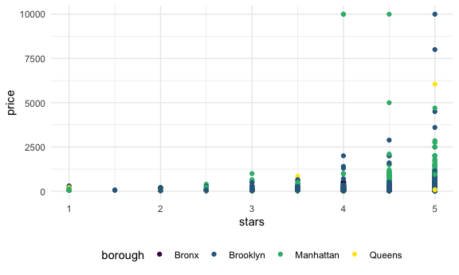

Linear Regression
================

Import data

``` r
data("nyc_airbnb")

nyc_airbnb = 
  nyc_airbnb %>% 
  mutate(stars = review_scores_location / 2) %>% 
  rename(
    borough = neighbourhood_group,
    neighborhood = neighbourhood) %>% 
  filter(borough != "Staten Island") %>% 
  select(price, stars, borough, neighborhood, room_type)
```

# Fit a model

``` r
nyc_airbnb %>% 
  ggplot(aes(x = stars, y = price, color = borough)) +
  geom_point()
```

    ## Warning: Removed 9962 rows containing missing values (geom_point).


